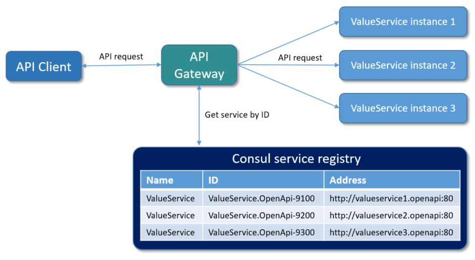

# Building API Gateway with load balancer and service discovery
When designing solutions based on the micro service architecture, we often encounter the requirement for quick and easy management of the entire system, the highest possible automation, without the necessary adjustment of individual components.

This is a real challenge and that’s why I decided to prepare a tutorial that demonstrates how to establish a micro service architecture in the simplest possible way, which can be quickly and very easily scaled and adapted to client requirements.

I did not want to interfere with the code and settings of individual services, but to control the system only with orchestrating containers in Docker.

The result is a simple micro service architecture that can be easily scaled with just a few changes in container settings, everything else is provided by Ocelot as gateway/load balancer and Consul as service discovery agent.

Such an architecture allows us redeployment of a single service without coordinating the deployment within other services. Redeployed service is automatically registered at service discovery and imediatelly available through gateway. You can imagine how big a boost this is for every development team!

Sure, using a single gateway service becomes a single point of failure to our architecture, so we need to deploy at least two instances of it to have high availability. But I will leave that problem to you to play with.

## Service self-registration
A key part of the tutorial is the use of the Consul to dynamically discover service endpoints. Once a service is registered with Consul, it can be discovered using typical DNS or custom API.

Consul provides health-checks on these service instances. If one of the service instances or services itself is unhealthy or fails its health-check, the registry would then know about this and would avoid returning the service’s address. The work that the load-balancer would do is handled by the registry in this case.

Because we use multiple instances of the same service, Consul would randomly send traffic to different instances. It thus balances the load between instances of services.

Consul handles challenges of failure detection and load distribution across multiple instances of services without the necessity of deploying a centralized load balancer.

It automatically manages the registry, which is updated when any new instance of the service is registered and becomes available to receive traffic. This helps us to easily scale the services.

Before getting into implementation details how to implement self-registration to Consul, let’s look into how service discovery with self-registration really works.

In a first step a service instance registers itself to the service discovery service by providing its name, ID and address. After this gateway is able to get address of this service by querying the Consul service discovery by its name/ID.

The key thing to note here is that the service instances are registered with a unique service ID in order to disambiguate between instances of service which are running on the same Consul service agent. It is required that all services have a unique ID per node, so if names might conflict (our case) then unique IDs must be provided.

## Architecture

## Conclusion
Micro service systems are not easy to build and maintain. This tutorial showed how easy it is to develop and deploy an application with microservice architecture.
HashiCorp Consul has first-class support for service discovery, health-check, key-value storage and multi-data centers. Ocelot as a gateway successfuly comunicates with Consul service registry and retrives service registrations, load balancer loops through available services and sends requests.
Using both makes life significantly easier for developers facing such challenges. Do you agree?

- [Visual Studio](https://www.visualstudio.com/vs/community) 2019 16.9.4 or greater
- [.NET SDK 5.0](https://dotnet.microsoft.com/download/dotnet/5.0)
- [Docker](https://www.docker.com/resources/what-container)

## Tags & Technologies
- [.NET 5.0](https://github.com/dotnet/core/blob/main/release-notes/5.0/5.0.5/5.0.5.md)
- [Docker](https://www.docker.com/resources/what-container)  
- [ASP.NET Core 5.0](https://docs.microsoft.com/en-us/aspnet/core/release-notes/aspnetcore-5.0?view=aspnetcore-5.0)
- [Ocelot](https://github.com/ThreeMammals/Ocelot)  
- [Consul](https://www.consul.io/)

## Contributing
Please refer to [CONTRIBUTING.md](CONTRIBUTING.md).

## Trademarks
Consul® is the registered trademark of HashiCorp.
