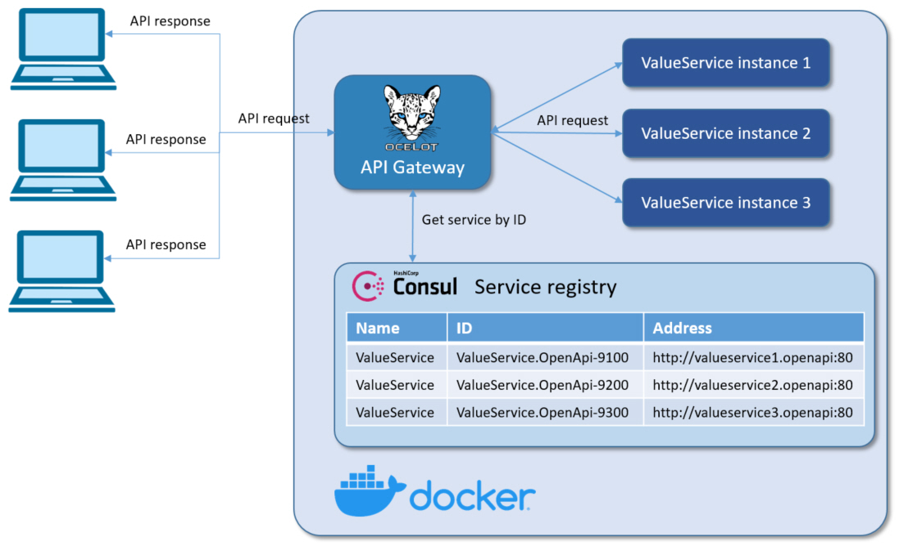

# Building API Gateway with load balancer and service discovery
When designing solutions based on the micro service architecture, we often encounter the requirement for quick and easy management of the entire system, the highest possible automation, without the necessary adjustment of individual components.

That is why I decided to prepare a tutorial that demonstrates how to establish a micro service architecture in the simplest possible way, which can be quickly and very easily scaled and adapted to client requirements.

I did not want to interfere with the code and settings of individual services, but to control the system only with the settings of containers in Docker.

The result is a simple micro service architecture that can be easily scaled with just a few code changes in container settings, everything else is provided by Ocelot as gateway/load balancer and Consul as service discovery.

We can do the redeployment of a single service without coordinating the deployment with other services which are automatically registered at service discovery and available through gateway. You can imagine how big a boost this is for every development team!

Sure, using a gateway service this becomes a single point of failure to our architecture, so we need to deploy at least two replicas of it to have high availability. But I will leave this problem for you to play with. :)

## What is Consul?
Consul is a service mesh solution providing a full featured control plane with service discovery, configuration, and segmentation functionality. Each of these features can be used individually as needed, or they can be used together to build a full service mesh. Consul requires a data plane and supports both a proxy and native integration model. Consul ships with a simple built-in proxy so that everything works out of the box, but also supports 3rd party proxy integrations such as Envoy.

The key features of Consul are:

**Service Discovery**: Clients of Consul can register a service, such as api or mysql, and other clients can use Consul to discover providers of a given service. Using either DNS or HTTP, applications can easily find the services they depend upon.

**Health Checking**: Consul clients can provide any number of health checks, either associated with a given service ("is the webserver returning 200 OK"), or with the local node ("is memory utilization below 90%"). This information can be used by an operator to monitor cluster health, and it is used by the service discovery components to route traffic away from unhealthy hosts.

**KV Store**: Applications can make use of Consul's hierarchical key/value store for any number of purposes, including dynamic configuration, feature flagging, coordination, leader election, and more. The simple HTTP API makes it easy to use.

**Secure Service Communication**: Consul can generate and distribute TLS certificates for services to establish mutual TLS connections. Intentions can be used to define which services are allowed to communicate. Service segmentation can be easily managed with intentions that can be changed in real time instead of using complex network topologies and static firewall rules.

**Multi Datacenter**: Consul supports multiple datacenters out of the box. This means users of Consul do not have to worry about building additional layers of abstraction to grow to multiple regions.

Consul is designed to be friendly to both the DevOps community and application developers, making it perfect for modern, elastic infrastructures.

Source: [Consul introduction](https://www.consul.io/docs/intro)

## Service self-registration
Before getting into implementation details how to implement self-registration to Consul, let’s look into how service discovery with self-registration really works.

In a first step a service instance registers itself to the service discovery service by providing its name and address. After this gateway is able to get address of this service by querying the Consul service discovery by its name.


## Architecture


#### Services:
* **Services.Gateway**: Gateway to all APIs
* **ValueService.OpenApi-9100**: OpenAPI REST ValueService instance, port 9100
* **ValueService.OpenApi-9200**: OpenAPI REST ValueService instance, port 9200
* **ValueService.OpenApi-9300**: OpenAPI REST ValueService instance, port 9300

First, each service instance registers itself to the service discovery service by providing its name and address.
After this step client is able to get information about this service by querying the service discovery.

## Gateway configuration
The following configuration shows how to set up multiple downstream services for a **Routes** using **ocelot.json** and use the **RoundRobin** load balancer and **Consul** service discovery.
```json
{
	"Routes": [
		{
			"Servicename": "ValueService",
			"DownstreamPathTemplate": "/{url}",
			"DownstreamScheme": "http",
			"UpstreamPathTemplate": "/{url}",
			"UpstreamHttpMethod": [ "POST", "PUT", "GET", "DELETE" ],
			"UseServiceDiscovery": true,
			"RouteIsCaseSensitive": false,
			"LoadBalancerOptions": {
			"Type": "RoundRobin"
			},
			"QoSOptions": {
				"ExceptionsAllowedBeforeBreaking": 3,
				"DurationOfBreak": 5000,
				"TimeoutValue": 2000
			}
		}
	],
	"GlobalConfiguration": {
		"RequestIdKey": "OcRequestId",
		"UseServiceDiscovery": true,
		"ServiceDiscoveryProvider": {
			"Host": "consul",
			"Port": 8500,
			"Type": "PollConsul",
			"PollingInterval": 100
		}
	}
}
```

# Running in Docker

## Docker-Compose Files
**Docker-compose.yml** file with setup for all the containers looks like this:
```yml
version: '3.9'

services:
   consul:
        image: consul:latest
        command: consul agent -dev -log-level=warn -ui -client=0.0.0.0
        hostname: consul
        container_name: consul
        networks:
            - common_network

   valueservice1.openapi:
        container_name: valueservice1.openapi
        image: valueservice.openapi:latest
        restart: on-failure
        hostname: valueservice1.openapi
        build:
            context: .
            dockerfile: src/ValueService.OpenApi/Dockerfile
        networks:
            - common_network

   valueservice2.openapi:
        container_name: valueservice2.openapi
        image: valueservice.openapi:latest
        restart: on-failure
        hostname: valueservice2.openapi
        build:
            context: .
            dockerfile: src/ValueService.OpenApi/Dockerfile
        networks:
            - common_network

   valueservice3.openapi:
        container_name: valueservice3.openapi
        image: valueservice.openapi:latest
        restart: on-failure
        hostname: valueservice3.openapi
        build:
            context: .
            dockerfile: src/ValueService.OpenApi/Dockerfile
        networks:
            - common_network

   services.gateway:
        container_name: services.gateway
        image: services.gateway:latest
        restart: on-failure
        hostname: services.gateway
        build:
            context: .
            dockerfile: src/Services.Gateway/Dockerfile
        networks:
            - common_network

networks:
    common_network:
        driver: bridge
```
**IMPORTANT!**

Instead of configure **ServiceConfig** from the service's **appsettings.json** configuration file
```csharp
public class ServiceConfig
{
	public string Id { get; set; }
	public string Name { get; set; }
	public string Address { get; set; }
	public int Port { get; set; }
	public Uri DiscoveryAddress { get; set; }
	public string HealthCheckEndPoint { get; set; }
}
```
I used the **Docker-compose.override.yml** file to inject the configuration to the services:

```yml
version: '3.9'

services:
    consul:
        ports:
             - "8500:8500"

    valueservice1.openapi:
        environment:
          - ASPNETCORE_ENVIRONMENT=Development
          - ServiceConfig__Id=ValueService.OpenApi-9100
          - ServiceConfig__Name=ValueService
          - ServiceConfig__DiscoveryAddress=http://consul:8500
          - ServiceConfig__Address=valueservice1.openapi
          - ServiceConfig__Port=80
          - ServiceConfig__HealthCheckEndPoint=healthcheck
        ports:
            - 9100:80
        depends_on:
            - consul

    valueservice2.openapi:
        environment:
          - ASPNETCORE_ENVIRONMENT=Development
          - ServiceConfig__Id=ValueService.OpenApi-9200
          - ServiceConfig__Name=ValueService
          - ServiceConfig__DiscoveryAddress=http://consul:8500
          - ServiceConfig__Address=valueservice2.openapi
          - ServiceConfig__Port=80
          - ServiceConfig__HealthCheckEndPoint=healthcheck
        ports:
            - 9200:80
        depends_on:
            - consul

    valueservice3.openapi:
        environment:
          - ASPNETCORE_ENVIRONMENT=Development
          - ServiceConfig__Id=ValueService.OpenApi-9300
          - ServiceConfig__Name=ValueService
          - ServiceConfig__DiscoveryAddress=http://consul:8500
          - ServiceConfig__Address=valueservice3.openapi
          - ServiceConfig__Port=80
          - ServiceConfig__HealthCheckEndPoint=healthcheck
        ports:
            - 9300:80
        depends_on:
            - consul

    services.gateway:
        environment:
            - ASPNETCORE_ENVIRONMENT=Development
            - ASPNETCORE_URLS=http://+:80
        ports:
            - 9500:80
        depends_on:
            - consul
            - valueservice1.openapi
            - valueservice2.openapi
            - valueservice3.openapi
```

# Setup the Containers
To execute compose file, open Powershell, and navigate to the compose file in the root folder. Then execute the following command: **docker-compose up -d --build --remove-orphans**. The -d parameter executes the command detached. This means that the containers run in the background and don’t block your Powershell window. To check all running Containers use **docker ps**.


## Consul Web UI
Consul provides a great web user interface out-of-the-box. You can access it on port 8500. In this case at **http://localhost:8500**. Let’s look at some of the screens.

The home page for the Consul UI services with all the relevant information related to a Consul agent and web service check.


## Check it out
Let’s make a first call through API Gateway **http://localhost:9500/api/values**. As we can see, we got response from **ValueService.OpenApi-9100**

With another request we got response from **ValueService.OpenApi-9200**

And again, we make another request and we got response from **ValueService.OpenApi-9300**


## Conclusion
Consul has first-class support for service discovery, health-check, key-value storage and multi-data centers. [Ocelot](https://github.com/ThreeMammals/Ocelot) successfuly comunicates with [Consul](https://www.consul.io/) service registry and retrives service registrations, load balancer loops through available services and sends requests.

Enjoy!

- [Visual Studio](https://www.visualstudio.com/vs/community) 2019 16.9.4 or greater
- [.NET SDK 5.0](https://dotnet.microsoft.com/download/dotnet/5.0)
- [Docker](https://www.docker.com/resources/what-container)

## Tags & Technologies
- [.NET 5.0](https://github.com/dotnet/core/blob/main/release-notes/5.0/5.0.5/5.0.5.md)
- [Docker](https://www.docker.com/resources/what-container)  
- [ASP.NET Core 5.0](https://docs.microsoft.com/en-us/aspnet/core/release-notes/aspnetcore-5.0?view=aspnetcore-5.0)
- [Ocelot](https://github.com/ThreeMammals/Ocelot)  
- [Consul](https://www.consul.io/)

## Contributing
Please refer to [CONTRIBUTING.md](CONTRIBUTING.md).

## Trademarks
Consul® is the registered trademark of HashiCorp.
